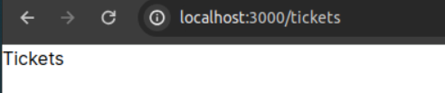

## Next.js Master Class
This repo contains all the course files for the Next.js Master Class on Net Ninja Pro. There is a branch for every lesson. Select the lesson you need from the branch dropdown.

Visit [Net Ninja Pro](https://netninja.dev) to view this course and many more.

## Getting Started with the Project

First, run the development server:

```bash
npm run dev
# or
yarn dev
# or
pnpm dev
```

Open [http://localhost:3000](http://localhost:3000) with your browser to see the result.

You can start editing the page by modifying `app/page.js`. The page auto-updates as you edit the file.

This project uses [`next/font`](https://nextjs.org/docs/basic-features/font-optimization) to automatically optimize and load Inter, a custom Google Font.

## Learn More

To learn more about Next.js, take a look at the following resources:

- [Next.js Documentation](https://nextjs.org/docs) - learn about Next.js features and API.
- [Learn Next.js](https://nextjs.org/learn) - an interactive Next.js tutorial.

You can check out [the Next.js GitHub repository](https://github.com/vercel/next.js/) - your feedback and contributions are welcome!

## Deploy on Vercel

The easiest way to deploy your Next.js app is to use the [Vercel Platform](https://vercel.com/new?utm_medium=default-template&filter=next.js&utm_source=create-next-app&utm_campaign=create-next-app-readme) from the creators of Next.js.

Check out our [Next.js deployment documentation](https://nextjs.org/docs/deployment) for more details.

### Experience along the lesson
En esta parte del curso se ha ido un paso más allá, ya que ahora nos interesa seleccionar un ticket en concreto, para ello, necistamos de alguna forma manejar una peticion GET a un ticket en específico para obtener su información.

Esto se realiza de la siguiente manera:

En ticketsList añadimos un enlace para cada ticket y que cuando el usuario clique sobre él vaya a un manejador espeífico para ese ticker (gracias a su id que es un identificador único):

```jsx
<div key={ticket.id} className="card my-5">
    <Link href={`/tickets/${ticket.id}`}>
        <h3>{ticket.title}</h3>
        <p>{ticket.body.slice(0, 200)}...</p>
        <div className={`pill ${ticket.priority}`}>
            {ticket.priority} priority
        </div>
    </Link>
</div>
```
Luego, creamos una nueva página dentro del directorio tickets que hace la llamada a la api de josn server para coger los datos de un ticket en específico:

```jsx
async function getTicket(id) {
  const res = await fetch(`http://localhost:4000/tickets/${id}`, {
    next: {
      revalidate: 60
    }
  })

  return res.json()
}


export default async function TicketDetails({ params }) {
  // const id = params.id
  const ticket = await getTicket(params.id)

  return (
    <main>
      <nav>
        <h2>Ticket Details</h2>
      </nav>
      <div className="card">
        <h3>{ticket.title}</h3>
        <small>Created by {ticket.user_email}</small>
        <p>{ticket.body}</p>
        <div className={`pill ${ticket.priority}`}>
          {ticket.priority} priority
        </div>
      </div>
    </main>
  )
}
```

¿Y cómo sabe a qué página tiene que ir? Pues porque el nombre del archivo es la propia ruta a la que se accede del lado del cliente, en tickets se tiene un subdirectorio llamado [id] que tiene una página que sirve para manejar un único ticket. (tiene que tener de nombre page para que lo identifique por defecto)

Aparte el parámetro que recibe la función dentro la página está en la propia ruta del navegador,es decir, el propio id. 



