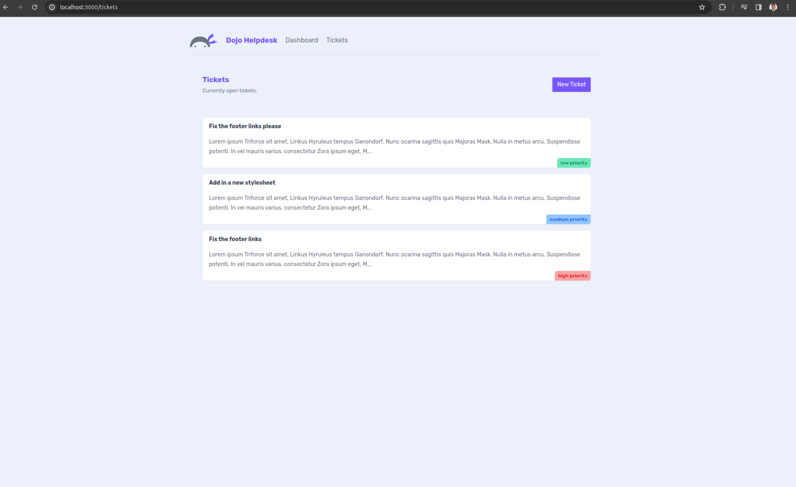

## Next.js Master Class
This repo contains all the course files for the Next.js Master Class on Net Ninja Pro. There is a branch for every lesson. Select the lesson you need from the branch dropdown.

Visit [Net Ninja Pro](https://netninja.dev) to view this course and many more.

## Getting Started with the Project

First, run the development server:

```bash
npm run dev
# or
yarn dev
# or
pnpm dev
```

Open [http://localhost:3000](http://localhost:3000) with your browser to see the result.

You can start editing the page by modifying `app/page.js`. The page auto-updates as you edit the file.

This project uses [`next/font`](https://nextjs.org/docs/basic-features/font-optimization) to automatically optimize and load Inter, a custom Google Font.

## Learn More

To learn more about Next.js, take a look at the following resources:

- [Next.js Documentation](https://nextjs.org/docs) - learn about Next.js features and API.
- [Learn Next.js](https://nextjs.org/learn) - an interactive Next.js tutorial.

You can check out [the Next.js GitHub repository](https://github.com/vercel/next.js/) - your feedback and contributions are welcome!

## Deploy on Vercel

The easiest way to deploy your Next.js app is to use the [Vercel Platform](https://vercel.com/new?utm_medium=default-template&filter=next.js&utm_source=create-next-app&utm_campaign=create-next-app-readme) from the creators of Next.js.

Check out our [Next.js deployment documentation](https://nextjs.org/docs/deployment) for more details.

### Experience along the lesson
En esta parte del curso se aprende como hacer peticiones a endpoints o a bases de datos, para obtener datos y saber manejarlos, recordamos que los componentes que estmaos creando son del lado del servidor, así que podemos escribir la lógica necesaria dentro de ellos.

En este caso se ha creado un fichero json con datos de prueba, se encuentra en el directorio _data, aparte de eso, si no 
tenemos esta dependencia tenemos que instalarla.
```bash
npm install json-server -g
```
Esto es necesario debido a que no tenemos un servidor corriendo. Lo ejecutamos de la siguiente manera, con las siguientes opciones:

*   json-server --watch --port 4000 ./_data/db.json

Lo más destacable es el componente tickets que se ha modificado:

```jsx
async function getTickets() {
  const res = await fetch('http://localhost:4000/tickets', {
    next: {
      revalidate: 0 // use 0 to opt out of using cache
    }
  })

  return res.json()
}

export default async function TicketList() {
  const tickets = await getTickets()

  return (
    <>
      {tickets.map((ticket) => (
        <div key={ticket.id} className="card my-5">
          <h3>{ticket.title}</h3>
          <p>{ticket.body.slice(0, 200)}...</p>
          <div className={`pill ${ticket.priority}`}>
            {ticket.priority} priority
          </div>
        </div>
      ))}
      {tickets.length === 0 && (
        <p className="text-center">There are no open tickets, yay!</p>
      )}
    </>
  )
}
```

Una vez corriendo el servidor json podemos ejecutar nuestra aplicación de nextjs como hemos hecho hasta ahora.

Actualmente el estado del proyecto sería de la siguiente manera:



