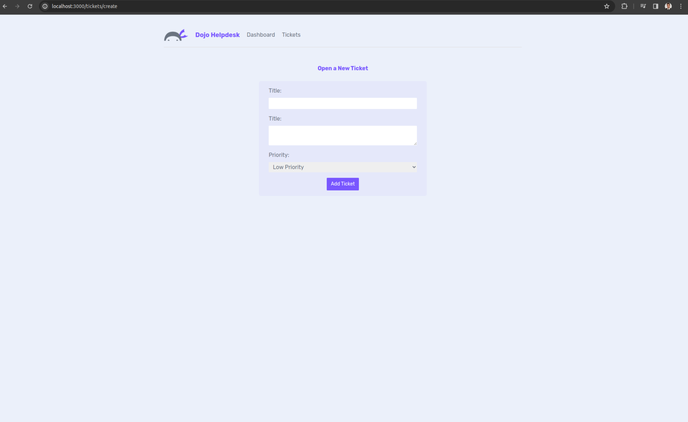

## Next.js Master Class
This repo contains all the course files for the Next.js Master Class on Net Ninja Pro. There is a branch for every lesson. Select the lesson you need from the branch dropdown.

Visit [Net Ninja Pro](https://netninja.dev) to view this course and many more.

## Getting Started with the Project

First, run the development server:

```bash
npm run dev
# or
yarn dev
# or
pnpm dev
```

Open [http://localhost:3000](http://localhost:3000) with your browser to see the result.

You can start editing the page by modifying `app/page.js`. The page auto-updates as you edit the file.

This project uses [`next/font`](https://nextjs.org/docs/basic-features/font-optimization) to automatically optimize and load Inter, a custom Google Font.

## Learn More

To learn more about Next.js, take a look at the following resources:

- [Next.js Documentation](https://nextjs.org/docs) - learn about Next.js features and API.
- [Learn Next.js](https://nextjs.org/learn) - an interactive Next.js tutorial.

You can check out [the Next.js GitHub repository](https://github.com/vercel/next.js/) - your feedback and contributions are welcome!

## Deploy on Vercel

The easiest way to deploy your Next.js app is to use the [Vercel Platform](https://vercel.com/new?utm_medium=default-template&filter=next.js&utm_source=create-next-app&utm_campaign=create-next-app-readme) from the creators of Next.js.

Check out our [Next.js deployment documentation](https://nextjs.org/docs/deployment) for more details.

### Experience along the lesson

En esta parte del curso el capítulo se centra un poco más en los estilos y el aspecto visual del sitio web.

Primero destacar las fuentes, es decir, el tipo de letra que se va a usar, que, en NextJS, se pude usar de la siguiente manera:

```jsx
import './globals.css'
import { Rubik } from 'next/font/google'

// components
import Navbar from './components/Navbar'

const rubik = Rubik({ subsets: ['latin'] })

```

Vemos como se importa la función Rubik del módulo de fuentes de Google para NextJS

El siguiente paso sería destacar que el CSS se pude escribir de forma clásica, o, se puede usar Tailwind CSS, que es un marco de trabajo para CSS que permite construir diseños personalizados.

Por último, se puede observar como se pueden usara imágenes en NextJS:

```jsx
import Link from 'next/link'
import Image from 'next/image'
import Logo from './dojo-logo.png'

export default function Navbar() {
  return (
    <nav>
      <Image
        src={Logo}
        alt='Dojo Helpdesk logo'
        width={70}
        placeholder='blur'
        quality={100}
      />
      <h1>Dojo Helpdesk</h1>
      <Link href="/">Dashboard</Link>
      <Link href="/tickets">Tickets</Link>
    </nav>
  )
}
```

A través del módulo Image de nextjs adjuntamos el elemento Image de forma parecida a como lo haríamos de forma clásica en HTML, pero más legible.

Actualmente el estado del proeycto se encuentra así:





